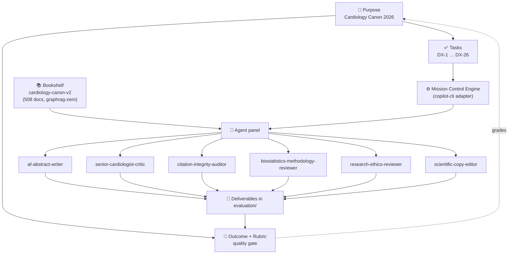
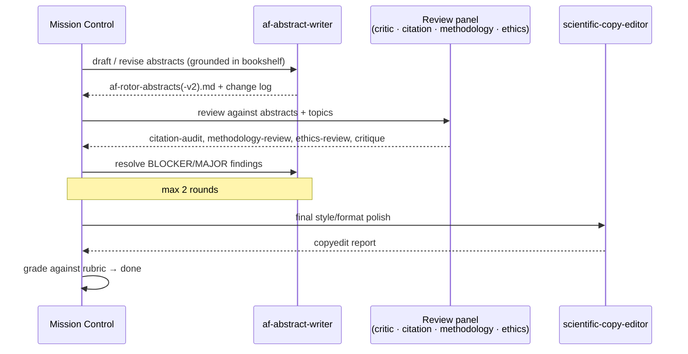

# Cardiology Canon 2026 — Rotors in Atrial Fibrillation

A worked example of running an **agentic research pipeline** inside
[Microsoft Discovery](https://www.microsoft.com/en-us/research/project/microsoft-discovery/)
(a VS Code–based research platform). Starting from a curated corpus of cardiology
literature, a team of specialised AI agents proposes novel research topics on the
role of **rotors / spiral-wave reentry in atrial fibrillation (AF)**, drafts fundable
research abstracts, and then peer-reviews them for citation integrity, statistical
rigour, and research ethics — all orchestrated through a chat-driven experience.

> This repository is the **method and the output**, not the source library. The
> underlying journal PDFs are copyrighted and are **not** committed here (see
> [Bring your own literature](#bring-your-own-literature)).

---

## ⚠️ Bring your own literature

The knowledge base was built from **hundreds of copyrighted journal articles and
society guideline PDFs** (NEJM, Lancet, JACC, Circulation, JAMA, and ESC / ACC /
CSANZ guidelines). Those files, and the search index that embeds their full text,
are deliberately excluded from version control via [.gitignore](.gitignore):

- `knowledge/` — the source PDFs.
- `.discovery/bookshelf/` — the graphrag index (embeds full document text).

To reproduce the pipeline, drop your own licensed PDFs into `knowledge/` and let
Discovery re-ingest them (see [The bookshelf](#the-bookshelf-cardiology-canon-v2)).
The short, attributed quotations that appear in the `evaluation/` deliverables are
used for scholarly commentary and citation-audit purposes.

---

## The Discovery paradigm

Discovery organises work around a small set of first-class objects that reference
one another. Everything below is real state in this repository, under `.discovery/`.



| Object | What it is | Where it lives |
|---|---|---|
| **Purpose** | The north-star statement the whole workspace serves | `.discovery/purpose.json` |
| **Outcome + Rubric** | A measurable definition of "done" and the questions used to grade it | `.discovery/outcomes/`, `.discovery/rubrics/` |
| **Tasks** | A hierarchy of `DX-…` work items with status transitions | `.discovery/tasks/` |
| **Bookshelf** | An ingested, indexed, retrievable literature corpus | `knowledge/` → `.discovery/bookshelf/` *(both git-ignored)* |
| **Engine** | A runner that orchestrates agents against tasks | `.discovery/engine/`, `.discovery/flows/` |
| **Agents** | Specialised, tool-scoped personas | `.github/agents/*.agent.md`, `.discovery/config.json` |

### The chat-driven experience

The entire pipeline was built and driven from **natural-language chat**. Rather than
writing scripts, the researcher asks for outcomes ("add an abstract-writer agent",
"peer-review these abstracts", "rerun the engine with the remaining agents") and the
assistant routes each request to the right Discovery tool — creating tasks, invoking
agents, running the engine, and writing deliverables. The declarative state in
`.discovery/` is the durable record of that conversation.

---

## The Purpose

> **Cardiology Canon 2026** — *"Build a comprehensive, searchable knowledge base
> from a curated collection of cardiology PDFs — enabling a cardiologist to retrieve,
> synthesize, and reason over clinical literature, guidelines, and research as a
> persistent second brain."*

Everything in the workspace is graded against this Purpose.

---

## The Outcome and rubric

The rotor-topics outcome is graded against a six-question rubric
(`.discovery/rubrics/`). The questions are:

1. **count** — exactly 5 distinct, non-overlapping topics.
2. **rationale** — each topic carries a one-sentence pathophysiology rationale.
3. **domain-span** — topics cover $\ge 3$ mechanistic domains (ion-channel / electrophysiology, fibrosis / structural substrate, mapping methodology, autonomic modulation).
4. **hypothesis-vs-evidence** — hypothesis-generating ideas are clearly separated from established evidence.
5. **precision** — precise electrophysiology language, no generic AF phrasing.
6. **grounding** — claims are cross-checked against the `cardiology-canon-v2` bookshelf with citations.

The generated topics scored **1.0 / 1.0** against this rubric.

---

## The Tasks

Tasks form a tree under the root **DX-1 (Cardiology Canon 2026)**. The rotor work
lives under **DX-18**:

| DX ID | Task | Status |
|---|---|---|
| DX-18 | Come up with 5 new research topics for the role of rotors in AF | complete |
| DX-20 | Write abstract: Fibrosis-dependent rotor anchoring (collagen-density gradients) | done |
| DX-21 | Write abstract: $I_{K,ACh}$-mediated APD shortening in vagal paroxysmal AF | done |
| DX-22 | Write abstract: Phase-singularity vs activation-sequence mapping discordance | done |
| DX-23 | Write abstract: Connexin-43 lateralization and rotor drift dynamics | done |
| DX-24 | Write abstract: Rotor-core thermal heterogeneity during RF ablation | done |
| DX-25 | Peer-review abstracts via the senior-cardiologist-critic agent | complete |
| DX-26 | Revise AF rotor abstracts to v2 (resolve review-panel findings) | executing |

Earlier tasks (DX-2 … DX-17) cover the knowledge-base build-out: ingest audits,
retrieval testing, query-pattern documentation, and directory-watch configuration.

---

## The bookshelf (`cardiology-canon-v2`)

The bookshelf is Discovery's retrieval layer. In this workspace it holds **508
indexed documents** using the **`graphrag-zero`** provider.

**How it works:**

1. **Ingest** — PDFs placed in `knowledge/` are picked up (a directory watch can
   auto-ingest new files).
2. **Index** — each document is chunked and embedded into a GraphRAG index stored
   under `.discovery/bookshelf/` *(git-ignored — it embeds the source text)*.
3. **Retrieve** — agents call the `bookshelf` tool (`search` / `ask`) to pull
   grounded, citation-bearing evidence into their reasoning.

**Scope and honest limits:** the corpus is composed of **clinical guidelines and
outcome trials** (e.g., 2020 ESC AF, 2021 EARLY-AF, 2010 THERMOCOOL AF, 2018
CASTLE-AF, 2019 CABANA, ablation-vs-drug, anticoagulation, HF, dyslipidemia). It
does **not** contain primary rotor basic-science (optical mapping, calcium
alternans, anisotropic conduction-velocity, ganglionated-plexi mapping, or the
original Narayan CONFIRM/FIRM papers). The pipeline is deliberately honest about
this: mechanisms it cannot ground are marked *hypothesis-generating* rather than
asserted. A researcher who wants stronger grounding simply adds the relevant
primary literature to `knowledge/` and re-runs the engine.

---

## The Mission Control engine

The **Mission Control** engine (`definitionId: mission-control`) is the orchestrator.
It uses the **`copilot-cli`** adapter, launching the GitHub Copilot CLI as the model
runtime and coordinating multiple agents across a task. A second definition,
`generic-copilot`, is also available.

- Engine definitions and flow pipelines live in `.discovery/engine/` and
  `.discovery/flows/` (`literature-review`, `experiment-protocol`,
  `experiment-pipeline`, `data-analysis-pipeline`).
- Setup notes for the CLI launcher are in
  [evaluation/copilot-cli-launcher-setup.md](evaluation/copilot-cli-launcher-setup.md).
- Verbose per-run CLI logs are git-ignored.

Unlike agents invoked ad-hoc from chat (which run read-mostly), **engine-run agents
can write files**, which is why the engine is used for the file-producing
write → critique → revise loop.

---

## The agent panel

Six domain agents were authored for this pipeline (exported to
`.github/agents/*.agent.md`, defined in `.discovery/config.json`). Each is scoped to
a minimal tool set (`read`, `search`, `bookshelf`, `tasks`, `purpose`, `edit`).

| Agent | Role |
|---|---|
| **af-abstract-writer** | Drafts and revises structured, fundable AF/rotor abstracts (Background · Hypothesis · Methods · Expected Results · Significance), grounded in the bookshelf, with LaTeX notation and honest hypothesis-vs-evidence framing. |
| **senior-cardiologist-critic** | A demanding senior electrophysiologist / guideline-author persona that critiques artifacts for mechanistic accuracy, evidence grounding, methodological rigour, and clinical relevance. Critiques — does not write. |
| **citation-integrity-auditor** | Verifies every citation against the bookshelf; flags overstated, misattributed, unverifiable, or hallucination-risk references. |
| **biostatistics-methodology-reviewer** | Reviews study designs for unit-of-analysis, clustering, power/sample-size logic, named analysis plans, and feasibility. |
| **research-ethics-reviewer** | Checks human/animal/invasive-procedure readiness and required approvals (IRB / IACUC / IDE). |
| **scientific-copy-editor** | Final style, terminology, LaTeX, and word-count polish without changing scientific meaning. |

*(A `novelty-prior-art-scout` agent was prototyped and then removed once the
bookshelf-only grounding policy was adopted.)*

### How they orchestrate

The engine runs a bounded **write → critique → revise** loop:



---

## Deliverables

All outputs live in [evaluation/](evaluation/):

| File | Produced by |
|---|---|
| [af-rotor-research-topics.md](evaluation/af-rotor-research-topics.md) | topic-generation (DX-18) |
| [af-rotor-abstracts.md](evaluation/af-rotor-abstracts.md) | af-abstract-writer (DX-20…24) |
| [af-rotor-abstracts-critique.md](evaluation/af-rotor-abstracts-critique.md) | senior-cardiologist-critic |
| [af-rotor-citation-audit.md](evaluation/af-rotor-citation-audit.md) | citation-integrity-auditor |
| [af-rotor-methodology-review.md](evaluation/af-rotor-methodology-review.md) | biostatistics-methodology-reviewer |
| [af-rotor-ethics-review.md](evaluation/af-rotor-ethics-review.md) | research-ethics-reviewer |
| [research-workflow-sop.md](evaluation/research-workflow-sop.md) | workflow documentation |
| [af-rotor-mechanisms-workflow.ipynb](evaluation/af-rotor-mechanisms-workflow.ipynb) | reproducible analysis notebook |

The example science uses standard electrophysiology relations, e.g. the reentry
wavelength $\lambda = \text{CV} \times \text{ERP}$ and conduction anisotropy
$\text{CV}_L / \text{CV}_T$; the ablation-thermal abstract couples a monodomain
propagation model with the Pennes bioheat equation.

---

## Repository layout

```
README.md                     ← this file
requirements.txt              ← minimal Python/notebook deps
.github/
  copilot-instructions.md     ← workspace assistant behavior
  agents/*.agent.md           ← exported agent definitions
.discovery/                   ← Discovery declarative state (purpose, tasks, …)
  purpose.json  tasks/  outcomes/  rubrics/  grades/  flows/  config.json
  bookshelf/                  ← git-ignored (copyrighted index)
knowledge/                    ← git-ignored (copyrighted source PDFs)
evaluation/                   ← generated deliverables + notebook + SOP
```

---

## Reproduce it yourself

1. Open the workspace in Microsoft Discovery.
2. Add your own licensed cardiology PDFs to `knowledge/`.
3. Let the bookshelf ingest/index them (or trigger ingest from chat).
4. From chat, ask the assistant to run the Mission Control engine over the rotor
   tasks — it will orchestrate the writer + review panel and grade against the rubric.

### Python setup

This repo uses a minimal local notebook environment:

- `ipykernel==7.3.0`
- `pandas==3.0.3`

Install from the repo root:

```powershell
.\.venv\Scripts\python.exe -m pip install -r requirements.txt
```

### Dependency policy

Keep `requirements.txt` minimal:

- Add packages only when a notebook or supporting Python code imports them.
- Do not add broad data-science bundles speculatively.
- When adding a package, pin the version validated in the repo-local `.venv`.

---

## Disclaimer

This is a demonstration of an AI-assisted research **workflow**. The generated
topics and abstracts are hypothesis-generating drafts intended for expert review;
they are **not** peer-reviewed conclusions or clinical guidance.