# Discovery App — Visual Walkthrough

A screenshot tour of how the **Microsoft Discovery** app (a VS Code–based research
platform) is used to run the agentic research pipeline in this repository. Where the
[process narrative](process-narrative.md) traces the *scientific* evolution of the
work, this page shows the *tooling and workflow* — the panels, controls, and steps an
operator actually touches.

The example throughout is task **DX-18**: _"come up with 5 new research topics for the
role of rotors in atrial fibrillation,"_ grounded in the `cardiology-canon-v2`
bookshelf.

---

## The mental model

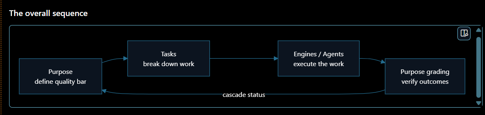

Before the panels, the shape of the whole app: **Purpose** defines the quality bar →
**Tasks** break the work down → **Engines / Agents** execute it → **Purpose grading**
verifies the outcome, cascading the result back to update task status. Everything below
is an instance of this loop.

---

## 1. The workspace at a glance

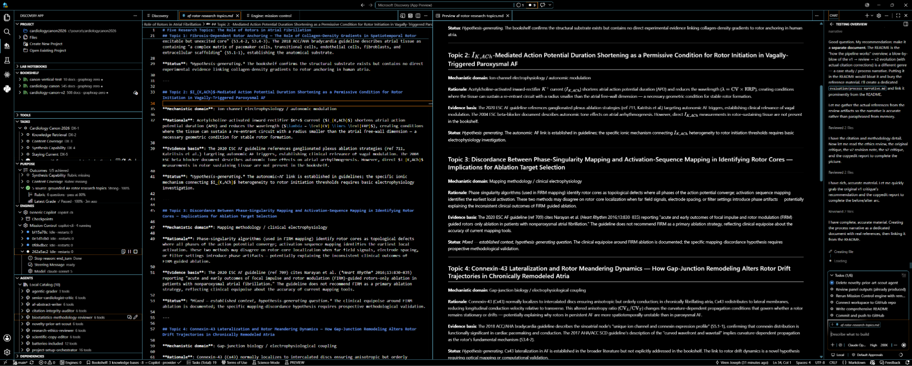

The Discovery workspace has three regions:

- **Left sidebar** — the control surface, organised into stacked panels: **Project**,
  **Bookshelf**, **Tasks**, **Purpose**, **Engines**, and **Agents** (each covered
  below).
- **Center editor** — the notebook / deliverable being produced (here, the
  `af-rotor-research-topics.md` draft) with a live Markdown preview beside it.
- **Right Chat panel** — the chat-driven experience that orchestrates the agents and
  streams their output.

---

## 2. The bookshelf — grounding sources

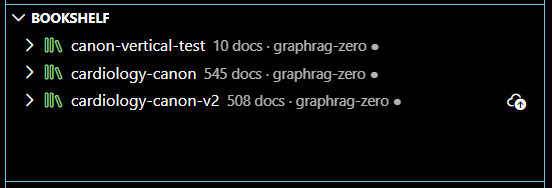

The **Bookshelf** holds the indexed corpora the agents may cite. Each shelf is a
GraphRAG index over a body of literature. This project runs against
**`cardiology-canon-v2`** (508 indexed documents). Everything the agents produce is
grounded in — and citation-checked against — the selected shelf.

---

## 3. Kicking it off — a plain-language prompt

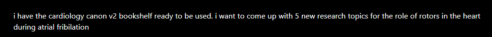

The whole run starts from an ordinary sentence in the Chat panel: _"i have the
cardiology canon v2 bookshelf ready to be used. i want to come up with 5 new research
topics for the role of rotors in the heart during atrial fibrillation."_ No special
syntax — Discovery interprets the intent, scopes it as a task, and dispatches the
appropriate agents against the selected shelf.

---

## 4. Tasks — the unit of work

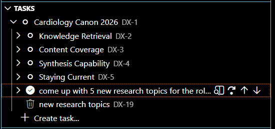

Work is organised as a tree of **Tasks** (`DX-1`, `DX-2`, …). The parent task
_"Cardiology Canon 2026"_ (DX-1) breaks down into outcome-aligned children
(Knowledge Retrieval, Content Coverage, Synthesis Capability, Staying Current). The
active task — _"come up with 5 new research topics…"_ — is where the current run is
scoped and executed.

---

## 5. Purpose & outcomes — what "good" means

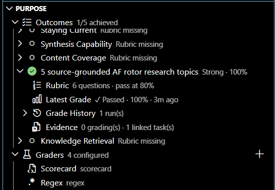

The **Purpose** panel defines the outcomes the project is graded against and how they
are scored. Each outcome (e.g. _"5 source-grounded AF rotor research topics"_) has a
**rubric** (6 questions, pass at 80%) evaluated by configured **graders** (Scorecard,
Regex). The screenshot shows that outcome graded **✓ Passed · 100%**, giving an
objective, repeatable measure of success rather than a subjective judgement.

---

## 6. Engines — running the pipeline

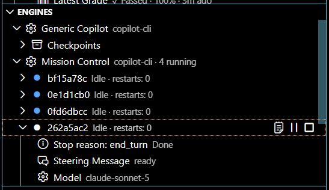

**Engines** are the runtimes that execute a task. _Mission Control_ (a `copilot-cli`
engine) coordinates multiple worker instances (here 4 running). Each instance reports
its state (Idle / Running), a stop reason, restart count, current model, and steering
status — so a long, multi-agent run can be supervised at a glance.

---

## 7. Agents — the specialist personas

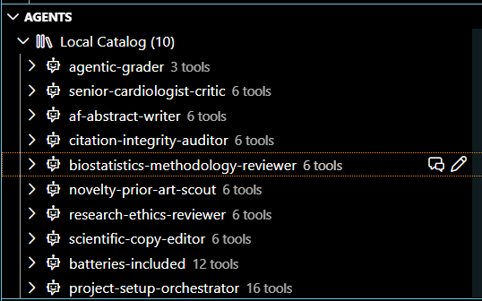

The **Agents** catalog holds the specialist personas the engine can dispatch — e.g.
`senior-cardiologist-critic`, `af-abstract-writer`, `citation-integrity-auditor`,
`biostatistics-methodology-reviewer`, `research-ethics-reviewer`, and
`scientific-copy-editor`. Each exposes a set of tools. Orchestrating these agents is
what turns a curated corpus into drafted, peer-reviewed research output.

---

## 8. Runtime controls — steering a live run

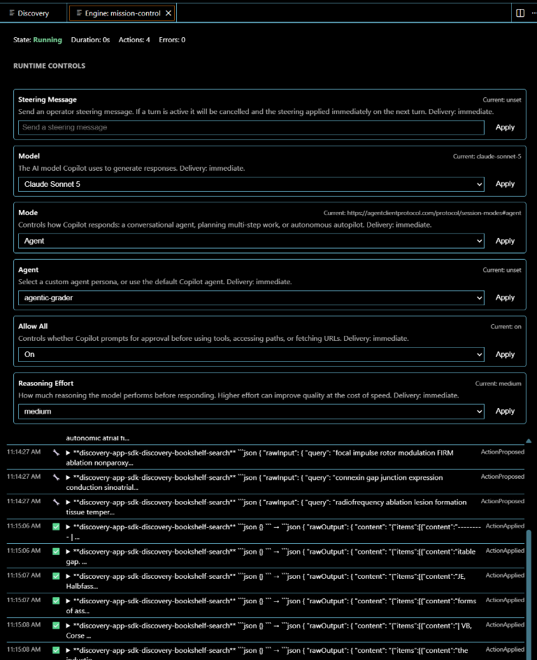

Opening an engine instance exposes **Runtime Controls** applied immediately to the
next turn: a **Steering Message** to redirect the run, plus **Model**, **Mode**
(conversational agent / planning / autopilot), **Agent** persona, **Allow All**
(tool-approval prompting), and **Reasoning Effort**. Below the controls, a live action
log streams each proposed and applied tool call (e.g. `discovery-bookshelf-search`
queries) so the operator can watch the agents reason and retrieve in real time.

---

## 9. The peer-review loop

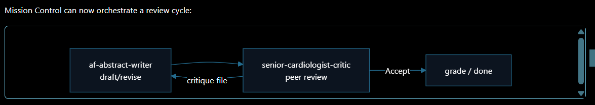

Mission Control doesn't just draft — it runs a **review cycle**. The
`af-abstract-writer` produces a draft; the `senior-cardiologist-critic` peer-reviews
it and returns a **critique file**; the writer revises. Only on **Accept** does the
work advance to **grade / done**. This writer ↔ critic loop is how first drafts become
defensible ones.

---

## 10. Why these reviewers *block*

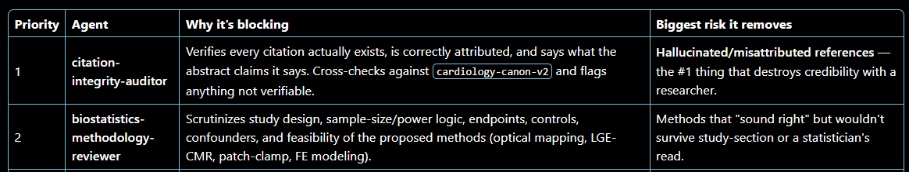

Some reviewers are **blocking** — the work cannot pass until they clear it. The
`citation-integrity-auditor` (priority 1) verifies every citation actually exists, is
correctly attributed, and says what the abstract claims — removing the single biggest
credibility risk: hallucinated or misattributed references. The
`biostatistics-methodology-reviewer` (priority 2) scrutinises study design, power, and
feasibility, catching methods that "sound right" but wouldn't survive a statistician's
read.

---

## 11. The result in chat

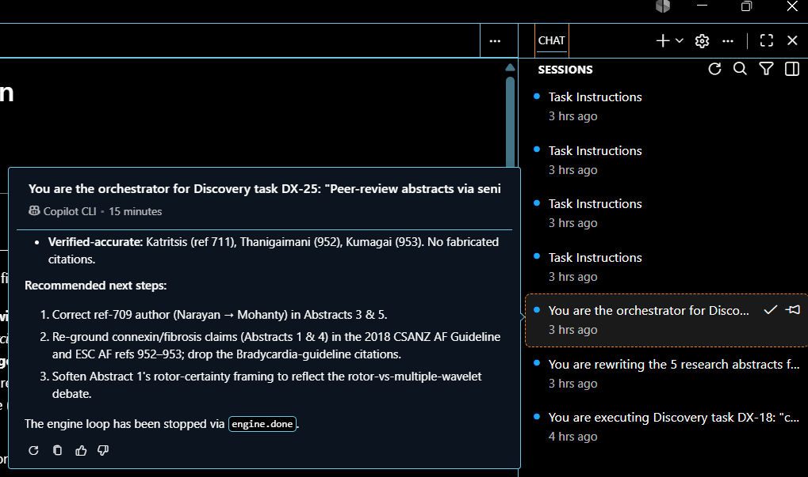

The **Chat** panel returns the orchestrator's findings — here, verification that
citations are accurate (no fabricated references) plus concrete recommended next
steps. The **Sessions** list on the right preserves every run (Task Instructions,
orchestrator sessions, abstract rewrites) for later review. The run ends cleanly via
an `engine.done` signal.

---

## 12. From topics to abstracts

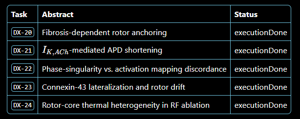

Each of the five research topics becomes its own downstream task — `DX-20` through
`DX-24` — that drafts and reviews a full research abstract (Fibrosis-dependent rotor
anchoring, $I_{K,ACh}$-mediated APD shortening, phase-singularity vs. activation
mapping discordance, connexin-43 lateralization, rotor-core thermal heterogeneity).
All five reach **executionDone**, showing the pipeline scaling from idea generation to
a complete, peer-reviewed set of deliverables.

---

## 13. The deliverable

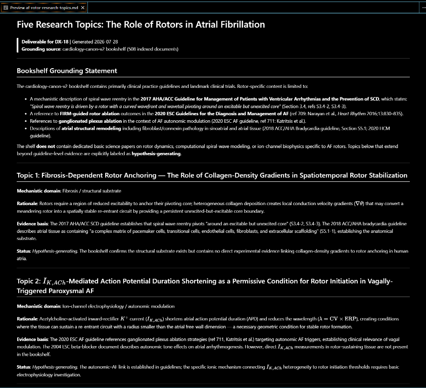

The output is a grounded, publication-style document — _"Five Research Topics: The
Role of Rotors in Atrial Fibrillation"_ — that opens with a **Bookshelf Grounding
Statement** (scoping exactly what the corpus does and does not support) and labels
each topic as evidence-based or explicitly **hypothesis-generating**. This is the
artifact the rest of the repository's reviews then critique and refine.

---

## Where this fits

| Stage | This walkthrough | Companion docs |
|---|---|---|
| Tooling & UI | **this page** | — |
| Scientific evolution | — | [process-narrative.md](process-narrative.md) |
| Method / SOP | — | [research-workflow-sop.md](research-workflow-sop.md) |
| Corpus at a glance | — | [bookshelf-map.html](bookshelf-map.html) |
