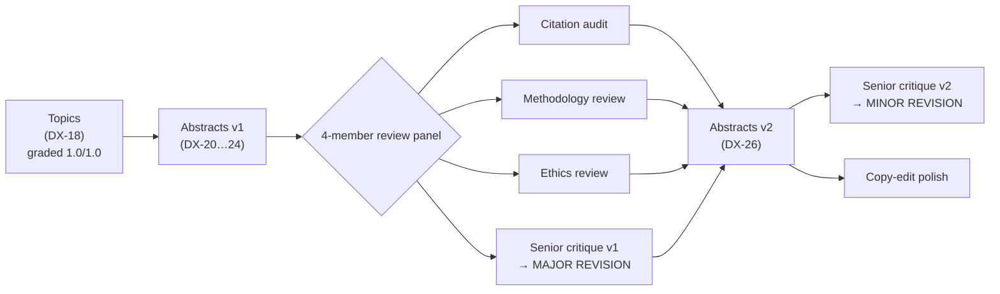

# From Topics to Peer-Reviewed Abstracts: How the AF-Rotor Review Evolved

> **Audience**: cardiologists / cardiac electrophysiologists who want to judge the
> *scientific* trajectory of this work — not the tooling.
> **What this is**: a chronological case study of how five hypothesis-generating
> AF-rotor abstracts moved from first draft → four independent expert reviews →
> a revised, defensible v2, with the **actual citations and findings** that drove
> each change.
> **Grounding source throughout**: the `cardiology-canon-v2` bookshelf (508 indexed
> guideline/trial documents). No external or web sources were used at any stage.
> **All artifacts referenced below live in** [evaluation/](.).

---

## 1. Why read this instead of the abstracts alone

The final abstracts ([af-rotor-abstracts-v2.md](af-rotor-abstracts-v2.md)) read
cleanly, but a reviewer's confidence comes from seeing **what was wrong first and
how it was corrected**. This document traces that arc so you can verify the
provenance of every material claim: which citation was misattributed, what the
correct attribution is, which mechanistic claim was overstated, and which study
design was not feasible as written.

The short version: the first draft was **competent but not shareable** — it
contained a repeated citation misattribution, a guideline quoted for content it
does not contain, an overstated rotor-certainty framing, and one abstract built on
a circular assumption. Four independent review agents surfaced these; a revision
pass resolved all of them; a final senior-reviewer pass moved the recommendation
from **Major Revision** to **Minor Revision**.

---

## 2. The pipeline, stage by stage

| Stage | Artifact | Verdict / outcome |
|---|---|---|
| Topic generation | [af-rotor-research-topics.md](af-rotor-research-topics.md) | 5 topics, graded **1.0 / 1.0** |
| First-draft abstracts | [af-rotor-abstracts.md](af-rotor-abstracts.md) | 5 abstracts (DX-20…24) |
| Citation audit | [af-rotor-citation-audit.md](af-rotor-citation-audit.md) | 3 verified · 2 overstated · 1 misattributed (×3) · 2 unverifiable |
| Methodology review | [af-rotor-methodology-review.md](af-rotor-methodology-review.md) | 4 "Needs revision" · 1 "Not feasible as written" |
| Ethics review | [af-rotor-ethics-review.md](af-rotor-ethics-review.md) | 2 NOT READY · 1 bench-ready/clinical-not-ready · 2 conditionally ready |
| Senior critique (v1) | [af-rotor-abstracts-critique.md](af-rotor-abstracts-critique.md) | **Major Revision** |
| Revised abstracts | [af-rotor-abstracts-v2.md](af-rotor-abstracts-v2.md) | all 6 blockers resolved |
| Senior critique (v2) | [af-rotor-abstracts-v2-critique.md](af-rotor-abstracts-v2-critique.md) | **Minor Revision** (6/6 resolved) |
| Copy-edit | [af-rotor-copyedit-report.md](af-rotor-copyedit-report.md) | style/LaTeX only, no meaning changed |

---

## 3. The five topics (DX-18)

Grounded in and cross-checked against the bookshelf, spanning four mechanistic
domains:

1. **Fibrosis-dependent rotor anchoring** — collagen-density gradients and rotor stabilization (structural substrate).
2. **$I_{K,ACh}$-mediated APD shortening in vagal paroxysmal AF** — autonomic → ionic → wavelength (ion-channel EP).
3. **Phase-singularity vs activation-sequence mapping discordance** — do two mapping methods localize the same rotor core? (mapping methodology).
4. **Connexin-43 lateralization and rotor drift** — gap-junction remodeling and meander (gap-junction biology).
5. **Rotor-core thermal heterogeneity during RF ablation** — Pennes bioheat lesion biophysics (RF biophysics).

The reentry wavelength relation $\lambda = \text{CV} \times \text{ERP}$ and
conduction anisotropy $\text{CV}_L / \text{CV}_T$ recur throughout.

---

## 4. What the review panel found — and how v2 fixed it

Each subsection below gives the **finding (with the real citation)**, then the
**resolution in v2**. This is the substantive heart of the evolution.

### 4.1 The headline: a repeated citation misattribution (ESC AF ref 709)

- **Finding [MISATTRIBUTED]** — v1 cited *2020 ESC AF Guideline* **ref 709** as
  "**Narayan et al.**, *Heart Rhythm* 2016;13:830–835" for FIRM-guided rotors-only
  ablation, in **three separate passages** (topics grounding, topic 3, Abstract 3).
  The reference number, title, journal, year, and pages are correct — but ref 709
  is authored by the **Natale group (Mohanty et al.)**, *not* Narayan. An external
  EP reviewer would immediately catch the conflation of Narayan's original
  CONFIRM/FIRM science with a different outcomes study.
- **Compounding [UNVERIFIABLE]** — Narayan's genuine primary paper
  (**Narayan SM et al., CONFIRM, *J Am Coll Cardiol* 2012;60:628–636**) is **not in
  the bookshelf** at all; a keyword search for Narayan / CONFIRM / "focal impulse
  and rotor modulation" returned no primary source.
- **Resolution in v2** — ref 709 is corrected to **Mohanty et al. (Natale group),
  *Heart Rhythm* 2016;13:830–835** in Abstracts 3 and 5, with an added caveat that
  it reports only **acute/early** outcomes and that rotors-only ablation efficacy
  **remains contested**. Narayan's CONFIRM (*JACC* 2012;60:628–636) is explicitly
  **flagged as an external source to be added**, not presented as canon.

### 4.2 A guideline quoted for content it does not contain (2018 Bradycardia)

- **Finding [OVERSTATED] → escalated to BLOCKER by the senior critic** — v1 quoted
  the *2018 ACC/AHA Bradycardia Guideline* passage S5.1-1 ("*a complex matrix of
  pacemaker cells, transitional cells, endothelial cells, fibroblasts, and
  extracellular scaffolding*") as evidence for the **atrial** rotor substrate. The
  quote is verbatim — but it describes the **sinoatrial node**, not atrial working
  myocardium. A bradycardia guideline was being used to anchor atrial
  fibrosis/gap-junction claims.
- **Resolution in v2** — all bradycardia-guideline citations were **removed from
  atrial claims**. The atrial-substrate statement is re-grounded in directly
  on-point canon: the **2018 CSANZ AF Guideline** ("*increase in interstitial
  fibrosis, alteration of gap-junctional proteins, altered refractoriness,
  conduction slowing…*") plus **2020 ESC AF Guideline refs 952–953** (Thanigaimani;
  Kumagai). The SA-node quote is reframed as describing the sinoatrial node.

### 4.3 An unlocatable HCM claim (dropped, not overstated)

- **Finding [OVERSTATED]** — v1 cited the *2020 ACC/AHA HCM Guideline* for
  "fibroblast/connexin pathology in atrial tissue." The guideline exists in canon
  and discusses AF, but **no passage supporting that specific claim could be
  located**.
- **Resolution in v2** — the claim was **dropped entirely** rather than propped up,
  and the Revision Note documents that no supporting passage was found.

### 4.4 Overstated rotor certainty (Abstract 1)

- **Finding [MAJOR]** — v1 framed rotors as *the* mechanism of AF. The bookshelf's
  own source (**2017 AHA/ACC/HRS SCD Guideline §3.4**, refs S3.4-2/-3) hedges: it
  describes spiral-wave reentry around "an excitable but unexcited core" but treats
  the rotor-vs-multiple-wavelet question as unsettled.
- **Resolution in v2** — Abstract 1 now opens by naming spiral-wave reentry as
  "*one proposed mechanism*" and states "*the relative contribution of rotors versus
  multiple-wavelet reentry remains debated*," mirroring the guideline's own hedge.

### 4.5 An ionic mechanism with no canon support (Abstract 2)

- **Finding [UNVERIFIABLE]** — no bookshelf source specifically supports the
  $I_{K,ACh}$ → APD shortening → $\lambda$ reduction → rotor mechanism. The only
  loosely related citation is ESC AF **ref 711 (Katritsis et al., *JACC*
  2013;62:2318–2325)**, which concerns autonomic/ganglionated-plexus ablation, not
  an ionic mechanism.
- **Resolution in v2** — the $I_{K,ACh}$ mechanism is now **explicitly labeled an
  unsourced hypothesis** (in both the background and the coverage table), and ref
  711 is restricted to "autonomic-AF **context only**, not for any ionic mechanism."

### 4.6 The FATAL one: a circular perfusion assumption (Abstract 5)

- **Finding [FATAL]** — Abstract 5 modeled rotor-core RF lesions with the Pennes
  bioheat equation
  $\rho c\,\partial_t T = \nabla\cdot(k\nabla T) + q_\text{RF} - \omega_b\rho_b c_b (T - T_a)$
  but **assumed** a distinct rotor-core perfusion $\omega_b$ — the very quantity the
  study purported to investigate. It also required a *perfused* preparation (a
  non-perfused ex-vivo model cannot test a perfusion hypothesis), and its
  fixed-target premise contradicted Abstract 4's drifting-rotor claim.
- **Resolution in v2** — $\omega_b$ becomes a **measured model input** (motivated via
  fibrosis / low-voltage co-localization, explicitly *not* derived from the
  "excitable but unexcited" electrical descriptor); a **perfused ex-vivo
  preparation** is mandated; and core-targeted ablation is **conditioned on prior
  demonstration of rotor spatial stability**, which also reconciles Abstract 5 with
  Abstract 4. The circularity is genuinely broken.

### 4.7 Cross-cutting methodology (all five abstracts)

- **Finding [MAJOR, all]** — none of the five had a sample-size/power justification
  or a named statistical-analysis plan; blinding and co-remodeling confounding
  recurred; Abstracts 3 and 5 needed **event-based** (not patient-based) powering.
  The methodology reviewer also noted the canon **lacks** a fibrosis-guided
  (DECAAF-type) trial, a primary FIRM/rotor-ablation RCT, and an RF-lesion
  biophysics dataset — so those endpoints cannot yet be benchmarked from the shelf.
- **Resolution in v2** — every abstract gained a concise **statistical plan** line
  (unit of analysis, clustering/ICC, primary endpoint, named model — e.g.
  mixed-effects with random intercept per patient; Bland–Altman + survival analysis
  for Abstract 3; event-based powering for Abstracts 3 and 5), with **no power
  figure asserted until assumptions are fixed** (no fabricated numbers).

### 4.8 Ethics / regulatory readiness (all five)

- **Finding** — the ethics reviewer classified each abstract by subject type and
  required approvals: Abstracts 1 and 3 **NOT READY** (prospective human imaging /
  invasive mapping + investigational-targeting); Abstract 5 **bench-ready but
  clinical/energy-titration arm NOT READY**; Abstracts 2 and 4 **conditionally
  ready** pending a stated tissue source (human → IRB/biobank/MTA; animal →
  IACUC + 3Rs). Novel-therapy surveillance expectations were anchored to the
  **2015 ACC LAAO device consensus**, and ablation risk/equipoise to the **2020 ESC
  AF Guideline**.
- **Resolution in v2** — each abstract gained an **ethics/approvals one-liner**
  (IRB / IACUC / MTA / IDE gating as applicable).

---

## 5. From Major Revision to Minor Revision

The senior-cardiologist-critic reviewed v1 and recommended **Major Revision** (the
bradycardia-guideline misattribution alone was blocking). After the revision, the
same critic reviewed v2 and recommended **Minor Revision**, confirming **6/6**
blocking findings resolved. Per-abstract evidence-grounding scores rose across the
board once the ref-709 misattribution, the bradycardia misapplication, and the HCM
claim were fixed. Abstract 3 (phase-singularity vs activation-sequence discordance)
scored highest — a clean paired method-comparison with an event-powered survival
design, squarely in the FIRM clinical-equipoise zone.

---

## 6. Residual open items (Minor, documented for the researcher)

These remain in v2 and are flagged honestly for author decision — none are blocking:

1. **[MAJOR-N1] Abstract 5 — sign of the fibrosis → $\omega_b$ relationship.** In the
   Pennes formulation the perfusion term is a **heat sink**: higher $\omega_b$ →
   greater convective loss → lower peak $T$ → shallower lesion. Fibrotic/low-voltage
   scar is typically **hypo-perfused** (lower $\omega_b$), which superficially
   predicts the *opposite* (deeper) lesion effect. Because $\omega_b$ is now measured,
   the study resolves this empirically — but the a priori Expected Results should
   either state and justify the expected sign or be made explicitly
   measurement-driven.
2. **[MAJOR-N2] Abstract 2 — leading-circle vs spiral-wave precision.** "$\lambda$
   short enough to fit the tissue" is **leading-circle** logic; rotor stability
   additionally depends on **restitution slope, wavefront curvature, and source–sink**
   relationships. Reword to avoid conflating the two functional-reentry paradigms
   (keep the *unsourced* tag).
3. **[MINOR-N3] [VERIFY] ESC AF refs 952–953 topical content.** Bibliographic
   identity is confirmed (Thanigaimani, *Expert Rev Cardiovasc Ther* 2017;15:247–256;
   Kumagai, *JACC* 2003;41:2197–2204), but confirm they support the *fibrosis-
   remodeling* claim specifically rather than autonomic modulation; if autonomic,
   rest the fibrosis grounding on the 2018 CSANZ AF quote alone.
4. **[MINOR-N4] [VERIFY]** Add a section/page locator to the 2018 CSANZ AF verbatim
   quote in Abstracts 1 and 4.
5. **[MINOR-N5]** Add one sentence framing fibrosis-anchoring (Abstract 1) vs
   coupling-drift (Abstract 4) as coexisting/opposing determinants, and scope
   Abstract 5 to the anchoring-dominant case.
6. **[NIT-N6]** Clarify that $\theta$ denotes local CV *magnitude* (an isotropic
   proxy), given Abstract 4's $\text{CV}_L / \text{CV}_T$ anisotropy focus.

**Copy-edit note:** all five abstracts run ≈355–480 words, above a typical
250–300-word journal limit; trimming was deliberately *not* done automatically to
avoid removing scientific content (flagged for author decision).

---

## 7. The single most important takeaway for a reader

The bookshelf holds **clinical guidelines and outcome trials**, not primary rotor
basic-science. The pipeline is deliberately honest about this: it grounds what it
can, marks everything else *hypothesis-generating* or *unsourced*, and refuses to
fabricate citations or power figures. To strengthen the grounding — especially for
the FIRM/rotor mechanism (Narayan CONFIRM, *JACC* 2012;60:628–636), a
fibrosis-guided ablation trial (DECAAF-type), and RF-lesion biophysics — a
researcher adds those primary papers to `knowledge/`, lets the bookshelf re-index,
and re-runs the review pipeline. The residual `[VERIFY]` items in §6 are exactly
where added primary literature would have the most impact.
